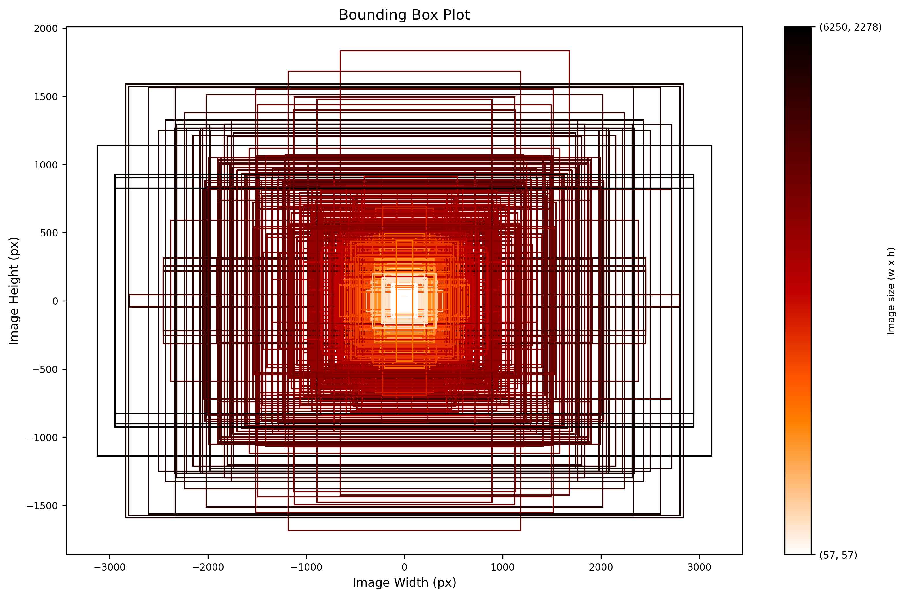

[](https://opensource.org/licenses/MIT)
[](https://pypi.python.org/pypi/visarchpy)
[](https://pypi.python.org/pypi/visarchpy)
[](https://pypi.python.org/pypi/visarchpy)
[](https://pypi.python.org/pypi/visarchpy)

[](https://visarchpy.readthedocs.io)

# VisArchPy

Data pipelines for extraction, transformation and visualization of architectural visuals in Python. It extracts images embedded in PDF files, collects relevant metadata, and extracts visual features using the DinoV2 model.
We ambition to make of this package Ai-powered tool with features for recorgnizing different types architectural visuals (types of buildings, structures, etc.). The package is still in development and we are working on adding more features and improving the existing ones. If you have any suggestions or questions, please open an issue in our [GitHub repository](https://github.com/AiDAPT-A/VisArchPy/issues). 

## Main Features

#### Extraction pipelines

- **Layout:** pipeline for extracting metadata and visuals (images) from PDF files using a layout analysis. Layout analysis recursively checks elements in the PDF file and sorts them into images, text, and other elements.
- **OCR:** pipeline for extracting metadata and visuals from PDF files using OCR analysis. OCR analysis extracts images from PDF files using Tesseract OCR.
- **LayoutOCR:** pipeline for extracting metadata and visuals from PDF files that combines layout and OCR analysis.

#### Metadata Extraction
- Extraction of medatdata of extracted images (document page, image size)
- Extraction of captions of images based on proximity to images and  *text-analysis* using keywords.

#### Transformation utilities
- **Dino:** pipeline for transforming images into visual features using the self-supervised  learning in [DinoV2.](https://ai.meta.com/blog/dino-v2-computer-vision-self-supervised-learning/)

#### Visualization utilities
- **Viz:** an utility to create a *bounding box plot*. This plot provides an overview of the shapes and sizes of images in a data set. 

    

## Dependencies

- Python 3.10 or 3.11
- [Tesseract v4.0 or recent](https://tesseract-ocr.github.io/)
- [PyTorch v2.1 or recent](https://pytorch.org/get-started/locally/)

## Installion

After installing the dependencies, install VisArchPy using `pip`.

```shell
pip install visarchpy
```

### Installing from source

1. Clone the repository.
    ```shell
    git clone https://github.com/AiDAPT-A/VisArchPy.git
    ```
2. Go to the root of the repository.
   ```shell
   cd VisArchPy/
   ```
3. Install the package using `pip`.

    ```shell
    pip install .
    ```

Developers who intend to modify the sourcecode can install additional dependencies for test and documentation as follows. 

1. Go to the root directory `visarchpy/`

2.  Run:

   ```shell
   pip install -e .[dev]
   ```

## Usage

VisArchPy provides a command line interface to access its functionality. If you want to VisArchPy as a Python package consult the [documentation](https://visarchpy.readthedocs.io).

1. To access the CLI:

```shell
visarch -h
```

2. To access a particular pipeline:

```shell
visarch [PIPELINE] [SUBCOMMAND]
```

For example, to run the `layout` pipeline using a single PDF file, do the following:

```shell
visarch layout from-file <path-to-pdf-file> <path-output-directory>
```

Use `visarch [PIPELINE] [SUBCOMMAND] -h` for help.

### Results

Results from the data extraction pipelines (Layout, OCR, LayoutOCR) are save to the output directory. Results are organized as following:

```shell
00000/  # results directory
├── pdf-001  # directory where images are saved to. One per PDF file
├── 00000-metadata.csv  # extracted metadata as CSV
├── 00000-metadata.json  # extracted metadata as JSON
├── 00000-settings.json  # settings used by pipeline
└── 00000.log  # log file
```

## Settings

The pipeline's settings determine how visual extraction from PDF files is performed. Settings must be passed as a JSON file on the CLI. Settings may must include all items listed below. The values showed belowed are the defaults.

<details>
  <summary>Available settings</summary>
  
```python
{
    "layout": { # setting for layout analysis
        "caption": { 
            "offset": [ # distance used to locate captions
                4,
                "mm"
            ],
            "direction": "down", # direction used to locate captions
            "keywords": [  # keywords used to find captions based on text analysis
                "figure",
                "caption",
                "figuur"
            ]
        },
        "image": { # images smaller than these dimensions will be ignored
            "width": 120,
            "height": 120
        }
    },
    "ocr": {  # settings for OCR analysis
        "caption": {
            "offset": [
                50,
                "px"
            ],
            "direction": "down",
            "keywords": [
                "figure",
                "caption",
                "figuur"
            ]
        },
        "image": {
            "width": 120,
            "height": 120
        },
        "resolution": 250, # dpi to convert PDF pages to images before OCR
        "resize": 30000  # total pixels. Larger OCR inputs are downsize to this before OCR
        "tesseract" : "--psm 1 --oem 3"  # tesseract options
    }
}
```
</details>

\
When no seetings are passed to a pipeline, the defaults are used. To print the default seetting to the terminal use:

```shell
visarch [PIPELINE] settings
```

## Citation
Please cite this software using as follows:

*Garcia Alvarez, M. G., Khademi, S., & Pohl, D. (2023). VisArchPy [Computer software]. https://github.com/AiDAPT-A/VisArchPy*

## Acknowlegdements

- AeoLiS is supported by the [Digital Competence Centre](https://dcc.tudelft.nl), Delft University of Technology.
- Reseach Data Services, Delft University of Technology, The Netherlands.
